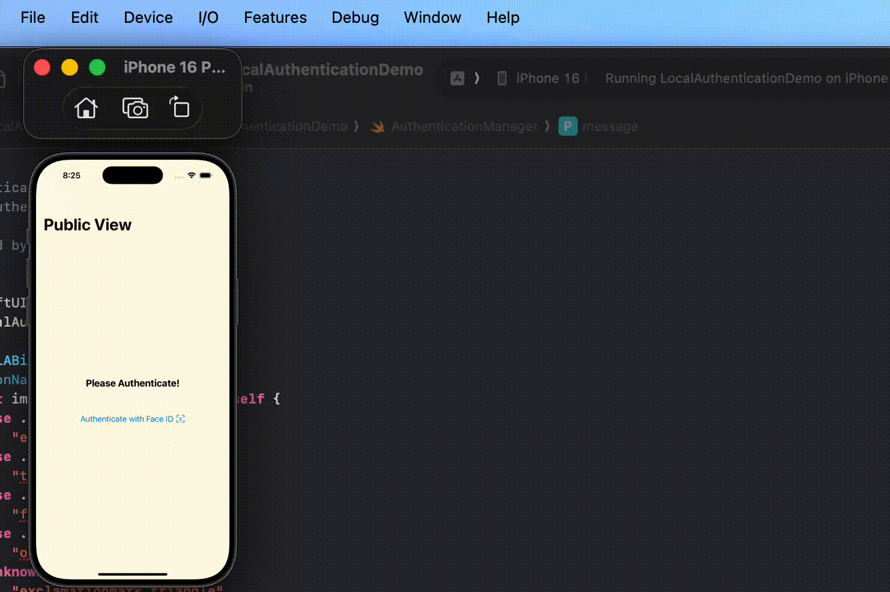

# SwiftUI: Biometric Authentication Demo

A demo of using Local Authentication Framework to perform biometric authentication, ie: FaceID, TouchID, OpticID.

Specifically, this demo includes
- Check biometric availability
- Customize system prompt
- request for authentication
- cancel authentication flow programmatically

To test biometric authentication using simulator, please refer to Apple's documentation on [Test Face ID or Touch ID authentication](https://developer.apple.com/documentation/xcode/testing-complex-hardware-device-scenarios-in-simulator#Test-Face-ID-or-Touch-ID-authentication)/

For more details, please refer to my blog [SwiftUI: Biometric Authentication with Local Authentication Framework]()

